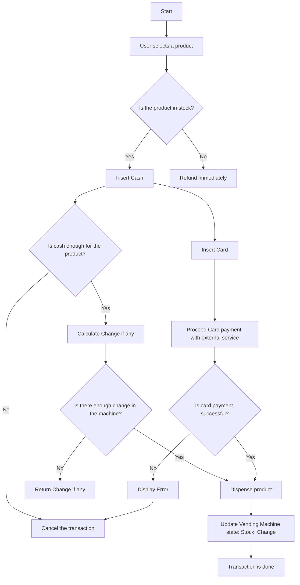

# Vending Machine

```mermaid
flowchart TD
    A[Start] --> B[User selects a product]
    B --> C{Is the product in stock?}
    C -->|Yes| D[Insert Cash]
    C -->|No| E[Refund immediately]

    D --> F{Is cash enough for the product?}
    F -->|Yes| G[Calculate Change if any]
    F -->|No| H[Cancel the transaction]

    G --> I{Is there enough change in the machine?}
    I -->|Yes| J[Dispense product]
    I -->|No| K[Return Change if any]

    J --> L[Update Vending Machine state: Stock, Change]
    L --> M[Transaction is done]

    D --> N[Insert Card]
    N --> O[Proceed Card payment with external service]
    O --> P{Is card payment successful?}
    P -->|Yes| J
    P -->|No| Q[Display Error]
    Q --> H
```
